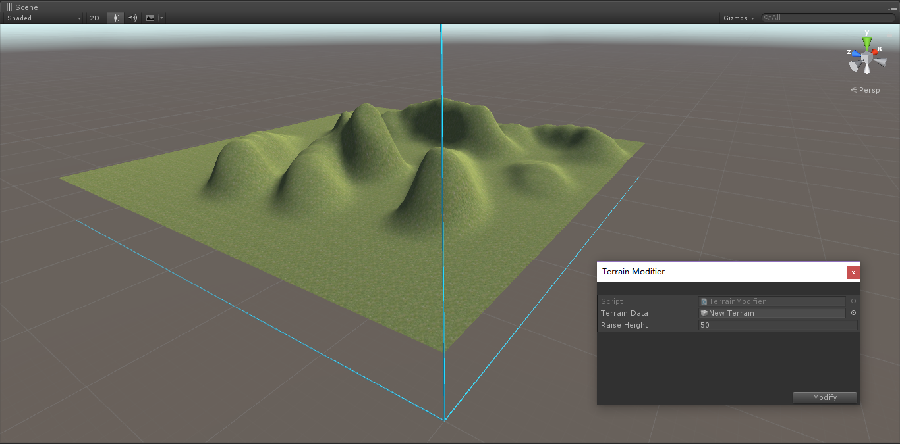

# TerrainModifier
- [English Manual](./README.md)

## 概述
- Unity 地形高度数据修改器。

## 需求
- Unity项目开发过程中，偶尔会遇到一些灾难性的问题，例如：地形（网格，贴图）已经刷好了，突然变更
  需求，要在原来地形上刷出河流或者盆地等向下凹陷的地貌，此时如果地形是以高度为0创建的，也就是说地
  平面高度为0，而Unity不允许将地形上任何一个地方的高度刷成负数，也就是这种情况下，无法完成河流，
  盆地等凹陷地貌的创建。所以希望能整体性地修改地形的高度图数据，将地形整体抬升，以便继续在原有地
  形上绘制地貌。

## 环境
- Unity 5.0 或更高版本。
- .Net Framework 3.0 或更高版本。

## 条件
- Unity提供TerrainData.GetHeights()方法访问/修改整个地形的高度数据。

## 方案
- 编写扩展编辑器窗口，指定目标地形数据，指定整体抬升高度（数值为负则降低）。
- 将目标地形的高度数据逐个加上整体抬升高度。

## 实现
- TerrainModifier： 绘制扩展编辑器窗口，整体修改地形高度数据。

## 图示
- TerrainModifier

## 联系
- 如果你有任何问题或者建议，欢迎通过mogoson@qq.com联系我。